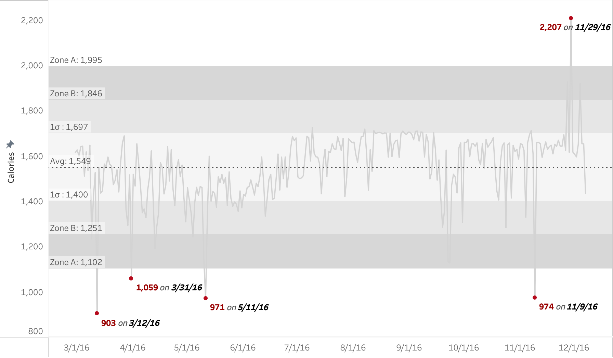
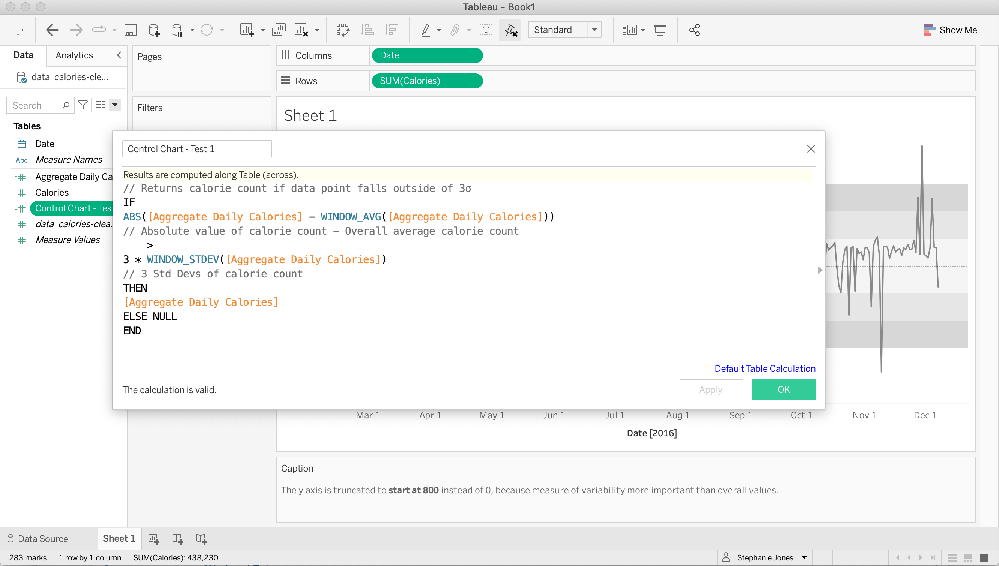
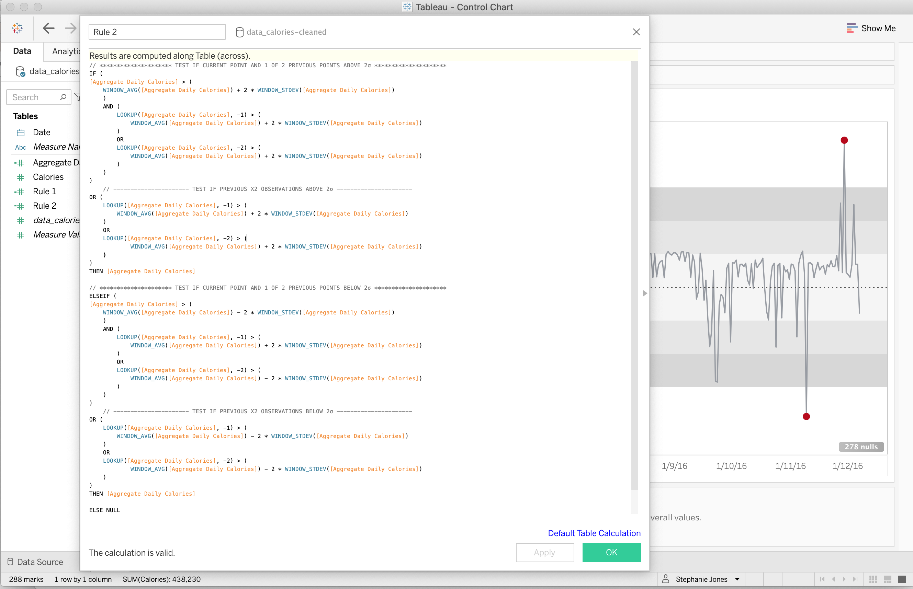

# Statistical Process Control Chart
>Thank you to [Ann Jackson](https://www.linkedin.com/in/annujackson/) for the concept breakdown. Check out her blog post [here](http://jacksontwo.com/statistical-process-control-charts).

## :medal_military: Goal 
Create a Statistical Control Chart using Tableau. Check out the final Tableau dashboard [here](https://public.tableau.com/views/ControlChart-CalorieCount/Dashboard1?:language=en-US&:display_count=n&:origin=viz_share_link). 

## :confused: Wait . . . statistical control, what?
According to [Wikipedia](https://en.wikipedia.org/wiki/Statistical_process_control), Statistical process control (SPC) or Statistical Quality Control (SQC) is a method of quality control, born out of the manufacturing industry, which uses statistical methods (*such as the average, mean, and standard deviation*) to monitor and control the quality of a process. This helps to ensure the process operates efficiently, producing more specification-conforming end products or results with less waste. SPC can be applied to any process where the *conforming product* (product meeting specifications) output can be measured. 

## . . . okay, but why?
An advantage of SPC over other methods of quality control, such as inspection, is that it emphasizes the early detection and prevention of problems, rather than the correction of problems after they have occurred. In addition to reducing waste, SPC can lead to a reduction production time because it makes it less likely that the end product will need to be reworked or scrapped.

## Final Notes
I followed Ann's walkthrough and explanation fo the calculation setups. I learned a lot (see bottom of ipynb Jupyter notebook above). The first calculation I created on my own, taking note of her solution and the last 2, for tests 2 and 3, I copied from her notebook because my attempt at test 2 was missing some data points. This took about 1/2 a day from start to finish and was a great exercise in learning a new analysis methodology and then how to visualize it in Tableau by building a dashboard that users can dynamically interact with through calculation and parameter logic. 

>Here is the Test 1 Calculation. I was able to follow the logic myself and write my own calculation for this one.

 

>Here is my attempt at the Test 2 Calculation. I ended up scrapping it and copying Ann's because it missed some of the data points but at some point would like to circle back and take another crack at it.

